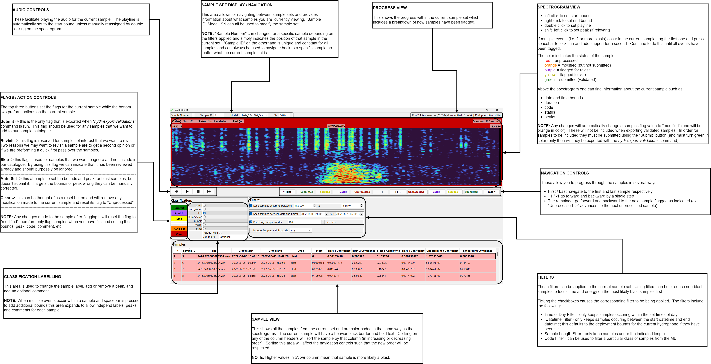

# hydr

## Requirements
1. Python
   > Download latest stable at version at 
   > [python.org](https://www.python.org/downloads/)
2. Port Audio - ***(only needed if installation of this package fails because of 
                    pyaudio)***
   ```bash
      # On Ubuntu OS run the following:
      $ sudo apt install portaudio19-dev python3-pyaudio
   ```
## Installation
After downloading and installing python open the terminal and run the following:
```bash
# 1. Upgrade pip to latest version
$ python -m pip install --upgrade pip
```
```bash
# 2. Install anaconda (virtual environment manager)
$ pip install anaconda
```
```bash
# 3. Upgrade anaconda to latest version
$ conda update -n base -c defaults conda
```
At some stage you will likely need to initialize the shell you are using to recognize 
anaconda commands (anaconda will provide the instructions to do so)
```bash
# 4. Create a new virtual environment
$ conda create -n hydr python=3.7.13
```
```bash
# 5. Activate the newly created virtual environment (NOTE: This environment must be 
#    enabled to use the scripts)
$ conda activate hydr
```
Following step may require installation of portaudio if pyaudio fails to install.  
```bash
# 6. Install this package
$ pip install git+https://github.com/MaxGunton/hydr.git
```

---

## CLI Commands
> **Warning**
> 
> Many scripts expect that hydrophones used are "Ocean Instrument SoundTraps" and that the directory structure and 
> naming convention for them is `.../<SN>/<SN>.yymmddHHMMSS.<extension>`.  It also assumes that audio files are in 
> `wav` format and that their corresponding log files share the same basename except with the extension `log.xml`. Any 
> deviation from these assumptions may cause inaccurate summaries or script failure.

---
### GENERAL
#### 1. Create Project Directory
Create a project directory structure for a new hydrophone deployment.  The `name` parameter becomes the name of the 
directory and the `dest` parameter is the directory in where it will be written (defaults to '.').     
```bash
usage: hydr-new-project [-h] [-d DEST] name

positional arguments:
  name                  root name of project directory

optional arguments:
  -h, --help            show this help message and exit
  -d DEST, --dest DEST  directory to save results

example:
  $ hydr-new-project ABC_Canada_20101010
```

---
#### 2. Create `'deployment.data'` file
This is the central file that will be used throughout the analysis.    
```bash
usage: hydr-new-depfile [-h] [-d DEST] [-c {SoundTrap}] datadir

positional arguments:
  datadir               directory containing all hydrophone data (ex.
                        00_hydrophone_data)

optional arguments:
  -h, --help            show this help message and exit
  -d DEST, --dest DEST  file/directory to save results
  -c {SoundTrap}, --convention {SoundTrap}
                        hydrophone convention used on of: (`SoundTrap`)

example:
  $ hydr-new-depfile ./00_hydrophone_data
```

---
#### 3. Set Deployment Bounds (i.e. starts/ends)
Set the starts/ends for each hydrophone; these are used throughout the analysis so only relevant audio is used.  
```bash
usage: hydr-set-bounds [-h] depfile

positional arguments:
  depfile     deployment data file

optional arguments:
  -h, --help  show this help message and exit

example:
  $ hydr-set-bounds deployment.data
```

---
#### 4. Scan Audio for Blasts
Send the audio through the ML model to detect any blasts. 
```bash
usage: hydr-classify-blasts [-h] [-D DEVICE] [-b BATCH_SIZE] depfile

positional arguments:
  depfile               deployment data file

optional arguments:
  -h, --help            show this help message and exit
  -D DEVICE, --device DEVICE
                        ex. 'cpu', 'cuda:0', ...
  -b BATCH_SIZE, --batch_size BATCH_SIZE
                        number of samples in batch
example:
  $ hydr-classify-blasts deployment.data
```

---
#### 5. Validate Blast Detections
Run the validator GUI to visually and audibly check blast detections.  This GUI automatically saves changes to the deployment.data file and the validations can later be exported using the `hydr-export-validations` command.
```bash
usage: hydr-run-validator [-h] depfile

positional arguments:
  depfile     deployment data file

optional arguments:
  -h, --help  show this help message and exit

example:
  $ hydr-run-validator deployment.data
```

---
### EXPORTING
#### 1. Export Hydrophone Summaries
This includes gaps in audio, start/end times, latitude/longitude, calibration info, etc. and takes the form of a txt file.  

```bash
usage: hydr-export-summaries [-h] [-s SNS] [-d DEST] depfile

positional arguments:
  depfile               deployment data file

optional arguments:
  -h, --help            show this help message and exit
  -s SNS, --sns SNS     serial numbers of hydrophones comma separated
  -d DEST, --dest DEST  directory to save results
  
example:
  $ hydr-export-summaries deployment.data
```

---
#### 2. Export Wavfile Details
This includes the durations, sample-rates, time to next file, etc. and takes the form of a csv.

```bash
usage: hydr-export-wavdetails [-h] [-s SNS] [-d DEST] depfile

positional arguments:
  depfile               deployment data file

optional arguments:
  -h, --help            show this help message and exit
  -s SNS, --sns SNS     serial numbers of hydrophones comma separated
  -d DEST, --dest DEST  directory to save results

example:
  $ hydr-export-wavdetails deployment.data
```

#### 3. Export Bounds
This includes both the audio and deployment start/end bounds, and takes the form of a csv.  

```bash
usage: hydr-export-bounds [-h] [-d DEST] depfile

positional arguments:
  depfile               deployment data file

optional arguments:
  -h, --help            show this help message and exit
  -d DEST, --dest DEST  file/directory to save results
  
example:
  $ hydr-export-bounds deployment.data
```

---
#### 4. Export ML Blast Classifications
This creates a csv containing the blast indexes for each hydrophone.  
```bash
usage: hydr-export-classifications [-h] [-d DEST] depfile

positional arguments:
  depfile               deployment data file

optional arguments:
  -h, --help            show this help message and exit
  -d DEST, --dest DEST  directory to save results

example:
  $ hydr-export-classifications deployment.data
```

---
#### 5. Export Manual Validations
Use the `hydr-run-validator` command to validate, the results from which are automatically saved to the deployment.data file and exported using the following command.     

```bash
usage: hydr-export-validations [-h] [-d DEST] depfile

positional arguments:
  depfile               deployment data file

optional arguments:
  -h, --help            show this help message and exit
  -d DEST, --dest DEST  directory to save results
  
example:
  $ hydr-export-validations deployment.data
```

---
### UTILITY
#### 1. Combine Multiple CSV Files
This is a convience function to combine multiple csv files.  
```bash
usage: hydr-combine-csvs [-h] [-d DEST] csvdir

positional arguments:
  csvdir                directory containing csv files

optional arguments:
  -h, --help            show this help message and exit
  -d DEST, --dest DEST  file/directory to save results
  
example:
  $ hydr-combine-csvs ./805351451
```

---
#### 2. Full Path in CSV
Convert the values in `file` column of csv from a base filename to an absolute path.  
```bash
usage: hydr-fullpaths-csvs [-h] datadir csvdir

positional arguments:
  datadir     directory containing all hydrophone data (ex.
              00_hydrophone_data)
  csvdir      directory containing csv files

optional arguments:
  -h, --help  show this help message and exit

example:
  $ hydr-fullpaths-csvs ./00_hydrophone_data ./805351451
```

---
#### 2. Basename in CSV
Convert the values in `file` column of csv from an absolute path to just the base filename.  

```bash
usage: hydr-basenames-csvs [-h] csvdir

positional arguments:
  csvdir      directory containing csv files

optional arguments:
  -h, --help  show this help message and exit
  
example:
  $ hydr-basenames-csvs ./805351451
```

## Validator

